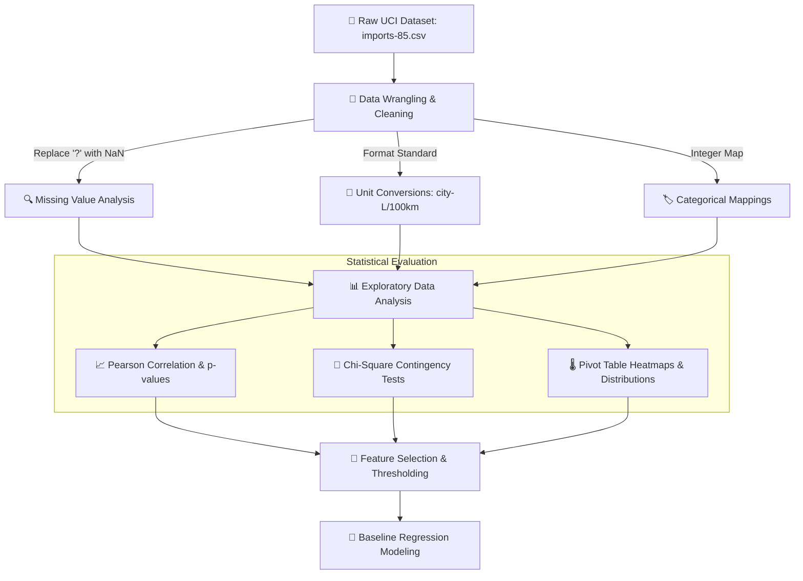

<div align="center">

# 📊 AutoValue AI - Exploratory Data Analysis & Statistical Modeling

[](https://car-price-predictor-front-end.vercel.app)
[](https://car-price-predictor-production-fdec.up.railway.app/docs)
[](https://www.python.org/)
[](https://jupyter.org/)
[](https://pandas.pydata.org/)
[](https://scipy.org/)

<p align="center">
  Comprehensive exploratory data analysis, hypothesis testing, and statistical evaluation on the 1985 Automobile Dataset. Covers data wrangling, Pearson correlations, Chi-Square tests of independence, and feature selection for regression modeling.
</p>

[Live Web App ↗](https://car-price-predictor-front-end.vercel.app) · [Backend API Repository ↗](https://github.com/seif-a096/car-price-predictor)

</div>

---

## 🔬 Analysis Workflow & Methodology



---

## 🛠️ Tech Stack & Libraries

| Library                  | Role                                                                              |
| :----------------------- | :-------------------------------------------------------------------------------- |
| **Pandas**               | Data manipulation, dataframe aggregation, pivot tables, and binning               |
| **NumPy**                | Numerical transformations, array operations, and linear spacing                   |
| **SciPy Stats**          | Pearson correlation coefficients ($r$, $p$-value) and Chi-Square ($\chi^2$) tests |
| **Seaborn & Matplotlib** | Heatmaps, regression plots (`regplot`), boxplots, and distribution histograms     |
| **Scikit-Learn**         | Train-test splitting, regression baselines, and $R^2$ / MSE scoring               |

---

## 🔍 Key Data Wrangling Steps

1. **Handling Missing Values (`?` sentinels)**:
   - The raw dataset encodes missing attributes as `"?"`. These were replaced with `np.nan`.
   - Columns with missing entries (`normalized-losses`, `bore`, `stroke`, `horsepower`, `peak-rpm`) were inspected. Mean and median distributions were compared to confirm mean-imputation validity.
   - Rows missing the target variable `price` were dropped to ensure supervised ground truth integrity.

2. **Unit Conversions & Standardization**:
   - Transformed fuel economy from miles per gallon (`city-mpg`) into the standard metric unit:
     $$\text{city-L/100km} = \frac{235}{\text{city-mpg}}$$

3. **Type Conversions & Integer Mappings**:
   - Number of doors mapped: `{"two": 2, "four": 4}`
   - Number of cylinders mapped: `{"two": 2, "three": 3, "four": 4, "five": 5, "six": 6, "eight": 8, "twelve": 12}`
   - Continuous numerical fields cast to `float64`.

---

## 📈 Statistical Hypotheses & Key Findings

### 1. Pearson Correlation Analysis (Numerical Predictors vs. Price)

We calculated Pearson correlation coefficients ($r$) alongside two-tailed $p$-values to quantify linear associations with vehicle price:

| Feature            | Pearson $r$ | $p$-value | Correlation Strength | Interpretation                                          |
| :----------------- | :---------: | :-------: | :------------------: | :------------------------------------------------------ |
| **`engine-size`**  |  **+0.87**  | $< 0.001$ | Very Strong Positive | Direct driver of vehicle cost                           |
| **`curb-weight`**  |  **+0.83**  | $< 0.001$ |   Strong Positive    | Larger, heavier chassis command higher prices           |
| **`horsepower`**   |  **+0.81**  | $< 0.001$ |   Strong Positive    | Performance output strongly tracks market value         |
| **`width`**        |  **+0.75**  | $< 0.001$ |   Strong Positive    | Wider vehicles reflect luxury and sports segments       |
| **`city-L/100km`** |  **+0.79**  | $< 0.001$ |   Strong Positive    | Higher fuel consumption correlates with premium engines |
| **`highway-mpg`**  |  **-0.70**  | $< 0.001$ |   Strong Negative    | Budget commuter cars exhibit higher fuel economy        |
| **`peak-rpm`**     |  **-0.10**  | $> 0.05$  | Weak / Insignificant | Weak negative correlation; minimal predictive value     |
| **`stroke`**       |  **+0.08**  | $> 0.05$  | Weak / Insignificant | Piston stroke alone does not explain price variance     |

---

### 2. Chi-Square ($\chi^2$) Test of Independence (Categorical Associations)

We evaluated whether vehicle configurations are statistically dependent using contingency cross-tabulations:

- **Hypothesis**: _Are Drive Wheels (`fwd`, `rwd`, `4wd`) significantly associated with Body Style (`sedan`, `hatchback`, `wagon`, `hardtop`, `convertible`)?_
- **Test Result**: $p < 0.05$, confirming a statistically significant structural association across vehicle segments (e.g., rear-wheel drive is heavily concentrated in high-end sedans, hardtops, and convertibles).

---

### 3. Segment Pricing Trends (Pivot Heatmaps)

- **Rear-Wheel Drive (RWD)** vehicles average significantly higher valuations across all body styles compared to Front-Wheel Drive (FWD) and 4WD counterparts.
- **Hardtop & Convertible RWD** models command the highest average price tiers ($>\$20,000$).
- **Hatchbacks** exhibit the lowest entry price distribution, primarily clustered in the budget range ($\$5,000 - \$10,000$).

---

## 🎯 Feature Selection & Modeling Insights

1. **Thresholding Weak Predictors**:
   - Filtered out variables with $|r| < 0.10$ against `price` to eliminate noise and reduce dimensionality on a small dataset.
2. **Dataset Scale & Regularization**:
   - Given the compact sample size (~200 records), over-parameterized models risk overfitting. A regularized Linear Regression pipeline with Scikit-Learn `ColumnTransformer` delivers strong out-of-sample generalization ($R^2 \approx 0.865$).
3. **Data Leakage Elimination**:
   - Identified that global one-hot encoding and imputation before train/test splitting caused subtle leakage in initial experiments. Transferred all statistical fittings into the standalone `Pipeline` in the backend service.

---

## 🚀 Running the Notebook Locally

1. **Clone the repository**:

   ```bash
   git clone https://github.com/seif-a096/car-price-predictor.git
   cd car-price-predictor/eda
   ```

2. **Install required packages**:

   ```bash
   pip install pandas numpy scipy matplotlib seaborn jupyter scikit-learn
   ```

3. **Launch Jupyter**:
   ```bash
   jupyter notebook car_price_predictor_eda.ipynb
   ```

---

## 📄 License

This project is licensed under the MIT License - see the [LICENSE](LICENSE) file for details.

© 2026 **AutoValue AI**. Developed by [Seif](https://github.com/seif-a096).
